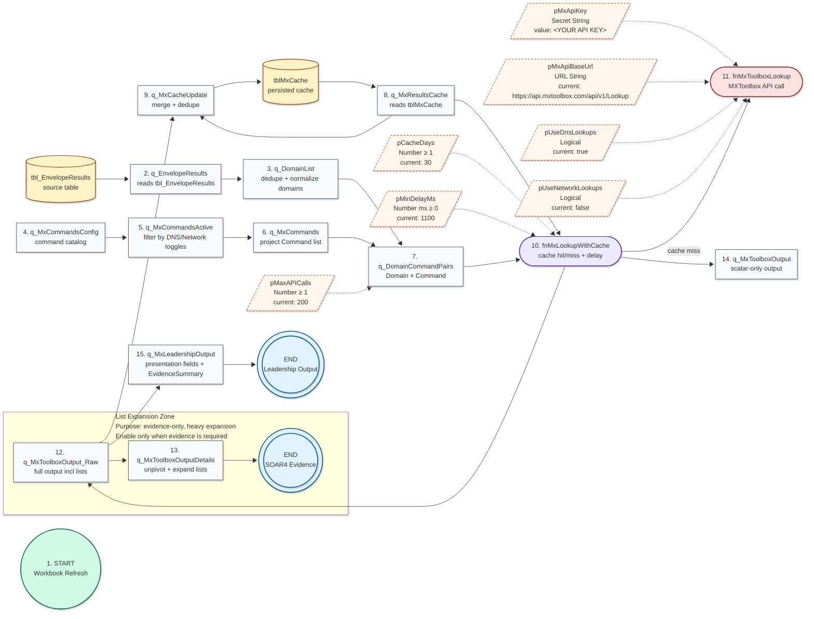

```mermaid
---
config:
  layout: fixed
  theme: default
  look: neo
---
flowchart LR
 subgraph LISTS["List Expansion Zone<br>Purpose: evidence-only, heavy expansion<br>Enable only when evidence is required"]
        OEvid((("END<br>SOAR4 Evidence")))
        QDetails["13. q_MxToolboxOutputDetails<br>unpivot + expand lists"]
        QRaw["12. q_MxToolboxOutput_Raw<br>full output incl lists"]
  end
    TEnv[("tbl_EnvelopeResults<br>source table")] --> QEnv["2. q_EnvelopeResults<br>reads tbl_EnvelopeResults"]
    QEnv --> QDomain["3. q_DomainList<br>dedupe + normalize domains"]
    QCmdCfg["4. q_MxCommandsConfig<br>command catalog"] --> QCmdAct["5. q_MxCommandsActive<br>filter by DNS/Network toggles"]
    QCmdAct --> QCmdList["6. q_MxCommands<br>project Command list"]
    QDomain --> QPairs["7. q_DomainCommandPairs<br>Domain × Command"]
    QCmdList --> QPairs
    p3[/"pMaxAPICalls<br>Number ≥ 1<br>current: 200"/] -.-> QPairs
    TCache[("tblMxCache<br>persisted cache")] --> QCacheRead["8. q_MxResultsCache<br>reads tblMxCache"]
    QCacheRead --> FLookup(["10. fnMxLookupWithCache<br>cache hit/miss + delay"]) & QCacheWrite["9. q_MxCacheUpdate<br>merge + dedupe"]
    p1[/"pCacheDays<br>Number ≥ 1<br>current: 30"/] -.-> FLookup
    p2[/"pMinDelayMs<br>Number ms ≥ 0<br>current: 1100"/] -.-> FLookup
    p4[/"pMxApiKey<br>Secret String<br>value: &lt;YOUR API KEY&gt;"/] -.-> FApi(["11. fnMxToolboxLookup<br>MXToolbox API call"])
    p5[/"pMxApiBaseUrl<br>URL String<br>current: https://api.mxtoolbox.com/api/v1/Lookup"/] -.-> FApi
    p6[/"pUseDnsLookups<br>Logical<br>current: true"/] -.-> FApi
    p7[/"pUseNetworkLookups<br>Logical<br>current: false"/] -.-> FApi
    QPairs --> FLookup
    FLookup -- cache miss --> FApi
    FLookup --> QRaw & QScalar["14. q_MxToolboxOutput<br>scalar-only output"]
    QRaw --> QCacheWrite & QLead["15. q_MxLeadershipOutput<br>presentation fields + EvidenceSummary"] & QDetails
    QCacheWrite --> TCache
    QLead --> OLead((("END<br>Leadership Output")))
    QDetails --> OEvid
    S(("1. START<br>Workbook Refresh"))

     OEvid:::endNode
     QDetails:::query
     QRaw:::query
     TEnv:::table
     QEnv:::query
     QDomain:::query
     QCmdCfg:::query
     QCmdAct:::query
     QCmdList:::query
     QPairs:::query
     p3:::param
     TCache:::table
     QCacheRead:::query
     FLookup:::func
     QCacheWrite:::query
     p1:::param
     p2:::param
     p4:::param
     FApi:::api
     p5:::param
     p6:::param
     p7:::param
     QScalar:::query
     QLead:::query
     OLead:::endNode
     S:::start
    classDef start fill:#d1fae5,stroke:#065f46,stroke-width:2px
    classDef endNode fill:#e0f2fe,stroke:#075985,stroke-width:2px
    classDef param fill:#fff7ed,stroke:#9a3412,stroke-dasharray: 5 3
    classDef func fill:#ede9fe,stroke:#5b21b6,stroke-width:1.5px
    classDef query fill:#f8fafc,stroke:#334155
    classDef table fill:#fef3c7,stroke:#92400e,stroke-width:1.5px
    classDef api fill:#fee2e2,stroke:#991b1b,stroke-width:1.5px
    classDef note fill:#f1f5f9,stroke:#475569,stroke-dasharray: 3 3
```
